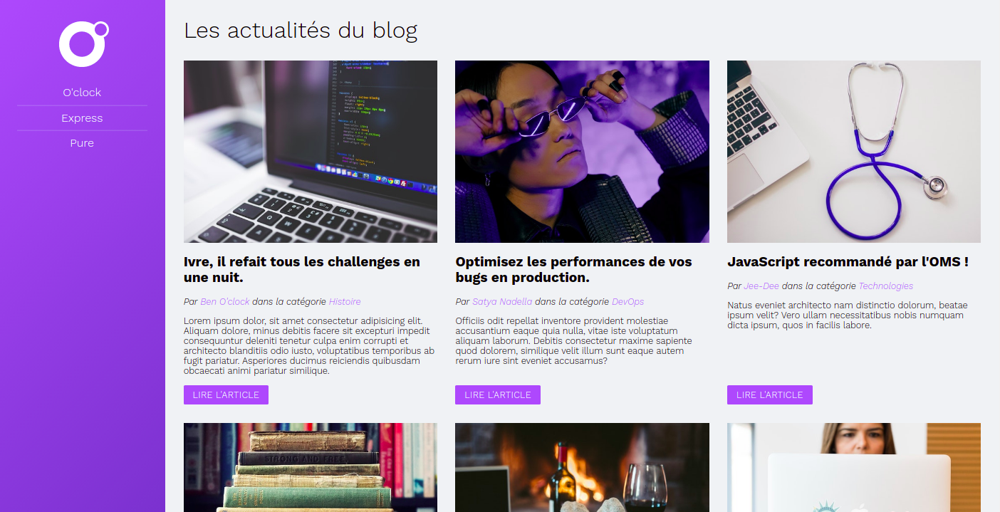

# O'Blog

Projet de réalisation d'une page web dynamique lors d'un exercice de fin de leçon de ma formation avec l'école O'Clock.

## Objectifs
Mettre en place :
- Un serveur avec Express.
- Un routage statique.
- Des views dynamiques et partialisées.
- Un routage paramétré.
- Une intégration léchée :star:.

Le tout, dans du code bien organisé.
